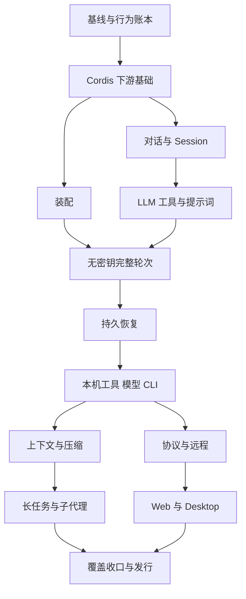

# 用 Go 复刻 DSH：实现与学习的共同路线

## 当前状态

本方案写于 2026-10-06。当前产品仍是 Cordis v0.1；Go 代码基线为 `f6645813fc79dce76fc1bf7dd109e252199006c3`。已有依赖生命周期、服务、事件、示例和文档门禁，具体范围由 [Cordis 对应表](../../cordis/source-map.md)维护。Loader、Session、LLM、工具、Agent Loop 和应用入口均未实现。

本次交付是规划、来源清单与学习组织方式。M0–M12 均未通过本方案验收；历史 Cordis 检查不能替代新方案的门禁。[执行状态](status.md)只覆盖下文的 M0 契约，不能据此判断整个 DSH 复刻已完成。

总体方案与 tRPC 选型已先以 `8ae84b9` 提交到公开仓库。本轮进一步将全部阶段拆为 [13 份阶段方案、81 个切片](stages/index.md)，分别列出实现产物、学习实验、依赖、失败场景和退出门禁；这些细化页仍是待实施方案。

## 两个共同目标

- **复刻**：能从固定 DSH 源码解释一项行为，用 Go 实现，并通过包含失败、取消和恢复的场景证明对应关系。[[goal:replication]]
- **学习**：掌握 Go 的读者能够从问题出发，运行实验，再定位 DSH 与 Go 两侧源码，解释相同点与差异。[[goal:learning]]

同一里程碑同时交付这两项。代码通过但笔记缺失，或笔记声称支持而行为没有证据，均不能通过。证据、当前状态和未来承诺分别维护。[[goal:evidence]]

## 来源与复刻口径

固定参考提交为 `00102833dfaee1da9f48a3a8eae9d34005a75218`，来源是 [DeepSeek Harness](https://github.com/deepseek-ai/deepseek-harness/tree/00102833dfaee1da9f48a3a8eae9d34005a75218)。本地参考树有未提交改动；盘点使用 Git 对象，未将这些改动纳入基线。更新参考版本要单独登记新增、移除、改义的行为，并重新评估受影响门禁。

[来源清单](source-inventory.json)记录 54 个 `packages` 包组、307 个直接工作区包和 9 个 vendor 包；嵌套测试 fixture、模板里的 package.json 不计入工作区包。另行列出 apps、Python、native、网站与工程支持面。[能力覆盖表](capabilities.md)为这些部分分配阶段。包数量只用于防漏，完成度按行为条目统计。

每个行为明确区分四层承诺：

| 层次 | 要求 | 验证方式 |
| --- | --- | --- |
| 概念对应 | 能解释角色、所有者、数据流与扩展点 | 学习笔记、两侧源码、预测实验 |
| 行为等价 | 输入、可观察输出、状态变化和错误语义一致 | 对应场景、trace 或差分测试 |
| 格式／协议兼容 | 指定配置、日志或协议版本可互读互操作 | 固定 fixture、跨实现契约测试 |
| Go 适配 | 目标相同，语言机制或可观察行为有差异 | 显式差异记录、理由、限制与 Go 测试 |

“能完成一次工具调用”只证明选定主链可用。未通过兼容测试前，不声称可读取原 DSH 会话、直接加载原 profile、复用原 Web 客户端或运行 npm 插件。M12 仍有计划内缺口时，只发布范围明确的版本，不能宣称完整复刻。

## 方案选择

| 候选方案 | 好处 | 代价 | 选择 |
| --- | --- | --- | --- |
| 按 TS 包逐个机械翻译 | 文件对应直观 | 提前复制大量拆包和动态机制，完整轮次很晚才能运行 | 不采用 |
| 先做一个 Go 聊天工具，随后补 DSH 概念 | 早期演示快 | 容易固定成单体循环，事件日志与插件能力变成事后补丁 | 不采用 |
| 按能力和纵向场景复刻，每步保存源码与语义对应 | 早期得到完整主链，同时保留 DSH 的可替换边界 | 需要持续维护契约和差异 | 采用 |

每次只实现一个可讲清楚、可独立验收的切片。无需先补齐全部 Cordis 动态 API；下游确实需要的能力先补。纯语言机制可用 Go 显式接口替代，语义差异不能用“更符合 Go”一笔带过。

## 模型接入选型：tRPC-Agent-Go

已确定使用 **tRPC-Agent-Go 的模型层**，通过本项目的 Provider 适配器接入。选型已经确认，具体依赖版本与 Go 工具链要求在 M4 的适配器实现时核对并锁定；当前尚未添加依赖或实现调用。

```text
agentloop（本项目的 DSH 行为实现）
  → llm（本项目的消息、请求、流与 Provider 契约）
  → plugins/llmtrpc（类型转换、能力映射与生命周期）
  → tRPC-Agent-Go model / model/openai
  → 模型服务
```

官方参考为 [Model 接口](https://github.com/trpc-group/trpc-agent-go/blob/main/model/model.go)与[独立模型调用示例](https://github.com/trpc-group/trpc-agent-go/blob/main/examples/model/main.go)。这些链接用于接入导航；实施时将所选版本、对应源码提交和兼容结果记录进模型源码对应表。

| 边界 | 责任 |
| --- | --- |
| `llm/` | 定义 DSH-Go 自己的消息、内容块、请求、流、usage 和错误语义；公共接口保持本项目类型 |
| `plugins/llmtrpc/` | 将自有类型转换为 tRPC 模型请求，将响应映射回自有流；管理取消、能力声明和提供方扩展 |
| tRPC-Agent-Go 模型层 | 承担模型调用与流式通信，首个接入使用 `model/openai` |
| `agentloop/`、`session/`、`tools/` | 由本项目按 DSH 契约实现，拥有轮次、权威日志、工具准入与执行 |

框架导入集中在适配器边界；核心包和持久化格式不得暴露 tRPC 的 Request、Response 或 Session 类型。集成范围限定为模型层，tRPC 的 Agent、Runner、Session 与工具执行器不承担本项目运行时职责。该选择也不要求把宿主改造为 tRPC RPC 服务。

M4 先建立 fake Provider 与自有契约，再完成 tRPC 适配器及无密钥的回环 HTTP 流测试；M5 的确定性主链仍使用 fake Provider。M7 将已验证适配器接入凭据和真实端点，联网 smoke 单独记录。适配器通过 Cordis 注册为可替换 Provider。

重试与 attempt 的记录由本项目策略拥有；接入时核对并配置 SDK 内部重试，避免两层重试或不可观察的重复请求。reasoning、工具调用参数分片、usage 缺失、流错误、取消、供应商扩展和回放信息均须通过[适配器门禁](acceptance.md#trpc-模型适配器门禁)。不支持的能力必须明确声明或返回可观察错误，不能静默丢失后声称完整复刻。

模型学习主题增加“DSH 概念 → 本项目 Go 类型 → tRPC 请求／响应”的三层映射，说明协议库与 Harness 语义各自的职责。模型层选型与其接入验收分开记录，当前确认选型不代表已经通过兼容门禁。

## 仓库组织

继续使用一个 Go module。以下是目标布局，除 `cordis`、现有文档与示例外均为规划；开始相关里程碑时才创建代码目录。

```text
cordis/                    通用插件、服务、事件与资源生命周期
loader/                    稳定条目、插件目录、配置装配
scope/                     Agent 作用域原语，与 Cordis 服务隔离区分
llm/                       消息、内容块、流、模型能力接口与组装
session/                   权威事件日志与消息投影
tools/                     工具定义、注册、策略与执行管线
systemprompt/              有序提示词片段和工具 schema
agent/                     公共 Agent 句柄、inbox 与工厂接口
agentloop/                 默认循环，作为 Cordis 插件提供工厂
persistence/               Session 句柄、格式与持久化接口
capability/<domain>/       fs、subprocess、approval 等能力接口
plugins/<provider>/        JSONL、模型、本地执行等具体 Provider
plugins/llmtrpc/            tRPC-Agent-Go 模型层适配器
app/                       profile、bundle、统一启动与关闭
cmd/dsh-go/                参数、终端 I/O、退出码与 app 装配
protocol/                  外部 RPC DTO、版本和兼容转换
internal/testkit/          确定性 fake、trace、时钟和 fixture 辅助
testdata/parity/           经来源核对的行为 fixture
examples/<topic>/          对应笔记的可运行实验
docs/learning/             跨模块学习地图
docs/<domain>/             当前概念、教程、行为参考与源码对应
docs/10-plans/<topic>/     后续方案、状态与验收证据
```

包以职责和依赖为依据；出现真实循环依赖才拆出共享类型，不提前建立万能 `common`、`utils` 或 `types` 包。`llm` 先提供对话词汇，Session 消费它；LLM Provider 不依赖具体 Session。`agentloop` 依赖 `agent`，扩展插件依赖 `agent`，不能反向绑定默认循环。工具依赖能力接口，不能导入某个本地或远程 Provider。

保留 Definition → Provider → Consumer 三个角色，是否分成三个包由依赖决定。类型库可以是普通 Go 包；具有注册和资源副作用的运行时能力通过 Cordis 贡献。标准 `context.Context` 传递取消，`cordis.Context` 管理贡献，`scope` 管理 Agent 可见性，三者各有责任。

产品只设一个 `cmd/dsh-go` 启动入口，示例保留独立入口。早期显式注册已编译 Go 插件；Node 动态 import、模块 HMR 与 npm 安装没有直接的 Go 二进制等价物，后续按能力评估配置重载、进程重启或协议插件。Web／Desktop 的默认路线是 Go Host 加已有技术栈客户端；是否复用 DSH 客户端必须由协议契约验证。这是客户端阶段的待验证选择。

## 里程碑

阶段顺序服务于学习和交付。M4 的模型与工具分支可独立设计，当前默认串行推进；真正并行实现时按 plan-and-phase 的 worktree 与资源规则处理。

| 阶段 | 可运行的复刻结果 | 同步学习产物 | 必须证明的行为 |
| --- | --- | --- | --- |
| M0 基线 | 固定来源、行为账本、Cordis 缺口分类 | 学习地图、Cordis 现状审计 | 每项有来源、状态、后续归属；来源未混入本地修改 |
| M1 Cordis 下游基础 | 满足 Loader 与核心 seam 所需的运行时 | Plugin/Fiber/激活、依赖图、effect 所有权、服务隔离与事件 | 缺失→激活→失效→清理→恢复；失败回滚；异步取消；差异显式 |
| M2 装配 | 显式插件目录、稳定 entry ID、分组、启停、配置更新、最小 profile | 编译期依赖与运行时装配；Entry 与 Fiber 的区别 | 未知插件、重复 ID、配置失败、更新保留身份、必需项失败与退出 |
| M3 对话与会话 | 消息／内容块词汇、内存 Session、事件序号与纯投影 | message、SessionEvent、实时 event 的区别；事件溯源 | 同一日志得到同一历史；未知必读内容拒绝；数据不会被调用者悄悄改写 |
| M4 请求与工具 | fake LLM 流、assembler、tRPC 模型适配器、fake 工具、schema、提示词与策略 seam | delta 与 message、DSH↔Go↔tRPC 类型映射、工具三角色 | 无密钥适配器契约；流中断与参数错误可观察；工具拒绝不执行；唯一最终结果 |
| M5 完整轮次 | Agent 公共句柄与默认 loop；无密钥完成两次模型请求和一次工具调用 | turn/step/request/attempt；inbox、取消、驱动与所有权 | 日志重建请求；取消不启动后续工具；失败可结算；关闭等待资源释放 |
| M6 持久恢复 | JSONL Provider、只读／写句柄、单写者、flush、恢复与版本边界 | append≠flush、idle≠落盘、投影≠存储、恢复≠重新执行工具 | 重开投影一致；崩溃尾部策略明确；双写者拒绝；未来格式拒绝 |
| M7 本机可用 | tRPC 模型适配器接入真实端点、凭据、workspace、fs/subprocess/shell、审批与沙箱策略、CLI | 能力与策略、执行世界、路径与进程所有权、重试边界 | 先过策略再产生副作用；模型接入与凭据配置；进程取消／输出限额；退出清理 |
| M8 上下文管理 | 指令与技能、引用与附件、token 计量、spill、compaction、preset/settings | 模型可见即已记录；上下文预算；压缩后可重放 | 请求可从日志重建；工具对不被拆坏；换路由、附件、截断与压缩失败有契约 |
| M9 长任务 | subagent、fork、控制与 mailbox，goal/todo/plan，jobs/schedule；workflow seam 与 fake 引擎 | 生命周期树与会话谱系、工作队列与时钟、持久状态机 | 父取消与子释放；隔离／深度／预算；重启后任务不盲目重放副作用 |
| M10 协议与远程 | SDK/API/ACP、MCP、LSP、SSH、Web 能力、外部 hook/插件桥 | 进程内接口与 wire DTO、请求关联、能力协商和版本 | 双向契约、断连／重连／取消、限流、授权与资源回收；指定版本互操作 |
| M11 客户端 | Go Host 的 Web UI 接入，随后 Desktop 载体 | Host 权威状态、客户端投影、实时流与断线快照 | 同一日志多客户端视图一致；重连无丢失／重复；审批归属与认证 |
| M12 覆盖收口 | 按清单补齐扩展与 Provider、跨平台发布、性能与运维 | 完整能力索引、版本差异、源码阅读路径与运维实验 | 基线账本无未归属项；所有承诺有测试／文档／版本证据；发布产物可复现 |

M5 是“可学习的最小 Harness”检查点，M7 是“本机可用”的检查点，M10 是协议互操作检查点。它们都不是完整 DSH 复刻的别名。M8–M12 仍包含多个独立子计划，每项的实际范围由[能力表](capabilities.md)追踪。



每个方框都包含实现与学习两项交付。主图表示能力依赖，不能代替未来各阶段 `plan.json` 的必要门禁；阶段内的新依赖要在启动前展开。

逐阶段的具体范围见[实施索引](stages/index.md)。M9 的 workflow 生产 Provider 依赖 PTC，由 [M12.4](stages/m12-conformance.md#实现与学习切片)完成；G9 验收 seam 与 fake 引擎，不提前承诺原脚本执行兼容。

M10 的基础协议可以在 M7 后开始；暴露压缩、子代理或任务能力的协议切片，还必须依赖 M8／M9 的相应 gate。M11 同样只接入已经验收的能力，完整界面联调在 M12 汇合。阶段编号不赋予未通过的能力可用状态。

## 各阶段的关键边界

**M0–M1：先把 Cordis 缺口变成可判断的问题。** 审查现有 source-map 的每个缺失项：下游阻塞、显式 Go 替代、后期诊断或尚待研究。优先验证服务依赖与释放顺序，不为了接近文件数量补 Proxy、decorator 或 generator 语法。服务 availability、内部通知、元数据、配置 intercept 与 volatile 是否必须实现，以 Loader／核心消费者的调用证据判断。已采用的串行生命周期、同步 Bail/Serial、显式事件过滤都必须保留差异说明。

**M2：配置先有身份和失败语义。** 第一切片可使用 JSON；JSON 仅是输入形式简化，不能隐式改变 entry 的身份、更新和失败语义。DSH Loader 的变更是 eager、非事务性的，Go 若提供整树事务，必须记为差异。后续补齐分层 patch、YAML/include、禁用、注入、惰性求值与配置重载，再验原 profile 兼容。配置解析失败保留旧树和激活过程中部分失败，是两类不同条件。

**M3–M5：让权威数据先于循环出现。** 先建立最小的 text、tool-call、tool-result 与事件词汇，再接 fake Provider。流式 delta 用于实时显示，settlement 形成持久事实；失败 attempt 不得伪装成功消息。扩展事件使用可注册 codec 或带判别字段的数据类型，明确未知事件政策，避免 `map[string]any` 在整个系统扩散。首个纵向实验是“用户输入→fake LLM 发起工具调用→fake 工具返回→下一次 LLM 回答→Session 重放”。

**M6：先说明格式承诺再处理磁盘。** 早期 Go 自有日志使用独立格式标识；不冒用 DSH 的 generation 名称或写入用户原 DSH 数据。源 DSH 的格式迁移、只读 open 与写 open、generation 发布和单写者规则进入行为账本。需要 DSH 日志互读时，另建固定版本 golden fixtures、迁移链和跨实现测试；能够处理 JSONL 不等于兼容 DSH Session。

**M7：副作用之前具备策略。** M4 的 fake 工具已经有准入接口；在本机文件写入与 shell 接入前完成相应审批、不可被后续插件放宽的守卫、沙箱 Provider 和取消。无审批应答者不能自动放行。路径规范化、执行 cwd、fs 与 subprocess 的执行世界必须一致。不同平台无法提供等价隔离时明确能力并拒绝不受支持的运行配置。真实 API 必须先过本地 HTTP 流 fixture；联网 smoke 单列，不把缺密钥当通过。

**M8–M9：保持所有模型可见信息可追溯。** prompt、skills、文件变化、压缩摘要、目标续跑都要有可重建的来源。子代理先做进程内 Provider，再考虑外部产品桥接；Agent 公共契约和提供方细节分离。持久排程明确幂等键、重试与恢复边界，不能把程序内部 goroutine 当作可靠任务系统。

**M10–M12：先证明协议，再连接界面。** 对 SDK、ACP、MCP、Web RPC 分别冻结协议版本，避免把它们合并为一个“支持 RPC”。Typert 的 TS 生成机制在 Go 中可以换实现，但 wire 行为需要逐项验证。浏览器、计算机操作、PTC、语音、Office、遥测、插件安装与实验性 Agent Teams 都在基线范围内：先分配归属，随后按独立计划验证；推迟实现会保留为缺口。源码许可、商标与资源引用按来源逐项核对，不假设顶层许可证自动覆盖全部资产。

上述边界的固定参考入口是 [DSH 架构](https://github.com/deepseek-ai/deepseek-harness/blob/00102833dfaee1da9f48a3a8eae9d34005a75218/docs/architecture.zh.md)、[核心与 Agent 契约](https://github.com/deepseek-ai/deepseek-harness/blob/00102833dfaee1da9f48a3a8eae9d34005a75218/docs/subsystems/core.zh.md)、[模型流](https://github.com/deepseek-ai/deepseek-harness/blob/00102833dfaee1da9f48a3a8eae9d34005a75218/docs/subsystems/llm-streaming.zh.md)、[工具管线](https://github.com/deepseek-ai/deepseek-harness/blob/00102833dfaee1da9f48a3a8eae9d34005a75218/docs/tool-execution-pipeline.zh.md)和[持久化](https://github.com/deepseek-ai/deepseek-harness/blob/00102833dfaee1da9f48a3a8eae9d34005a75218/docs/subsystems/persistence.zh.md)。实施时进一步定位对应符号和测试，不能仅凭架构概述认定行为一致。

## 每个切片怎样交付

1. 选一个用户可观察场景，固定参考源码、测试或文档，给出行为 ID、前置条件与输出。
2. 写 Go 设计和差异决策，标明依赖、所有者、取消、并发与持久边界。
3. 写可执行的行为断言及学习实验，再完成实现；将必要失败用例与成功用例一起交付。
4. 更新包 README、公开注释、当前参考页、源码对应和学习入口。API 生成只陈述签名，不能代替概念讲解。
5. 执行[共同验收标准](acceptance.md)，导出实际证据，再改变该行为的状态。

读者实验按[学习模板](../../learning/note-template.md)组织；常见概念和章节顺序由[学习地图](../../learning/index.md)维护。跨模块事实仍由所属模块文档负责，笔记链接过去，不另建重复的 Session／Tool 规则。

## 执行契约与恢复

[plan.json](plan.json)只细化 M0：

- [[node:source-baseline]] 审阅来源清单和能力分配，确认固定版本、盘点口径与复刻范围。
- [[node:cordis-audit]] 建立逐行为 Cordis 审计，给出实际测试入口和读者实验，确定 M1 的第一个切片。
- [[node:baseline-acceptance]] 同时验收复刻起点、学习路径和证据，输出下一阶段入口。

M0 通过后，根据审计结果将 [M1 细化方案](stages/m01-cordis.md)展开为执行契约；后续阶段按各自细化页同样推进。阶段与切片依赖已经成文，但 M1–M12 仍没有可领取的节点；领取前必须将预计目录展开为具体输入输出、真实检查与必要 gate。跨计划前驱证据的接入规则由[实施索引](stages/index.md#从细化方案进入执行)维护。

本次运行规划结构与文档校验，并按用户的提交推送要求执行当前仓库的发布前 `make check`；不 claim/start/verify 实施节点。未来包的检查命令将在实现落地且节点进入 running 后执行。发布前检查通过不解锁 M0 或未来阶段。未来新包必须扩展覆盖率和 API／文档检查的范围，不能沿用 Cordis 单包选择器后声称全仓通过相同要求。

通过后导出的 `validation/<run-id>` 保留为历史证据。后续修改同一实现文件会使依赖该文件的活动证据 stale；不可将旧计划一直显示为当前通过。每阶段新计划固定基线，必要时独立 worktree 集成，再重新验证当前版本。不得改写旧 report 或重复覆盖同名 run。参考 DSH checkout 始终只读。

## 当前下一步

从 M0 的来源审阅开始，随后写 `cordis-audit.md`：至少逐项覆盖 Plugin/Fiber、依赖失效、Scope、effect 回滚、事件分发、配置更新、取消等待和错误诊断。给出“Go 已有行为／TS 依据／对应测试／读者实验／差异或缺口”五列。该文件尚未创建，属于下一次实施的交付物。

M0 的最终评审要给出 M1 的有限范围及必需门禁。预期先验证 Cordis 的下游基础，再进入 Loader；不能仅因为现有覆盖率较高就跳过行为对照，也不要求读者学完全部 DSH 才开始第一个实验。
