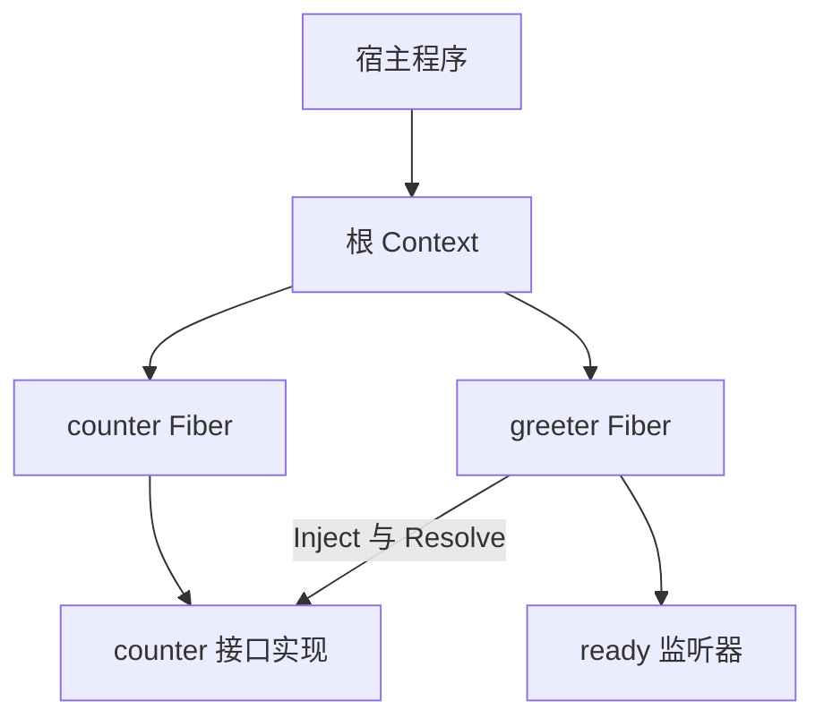

# 项目架构

## 概述

当前 Go 程序用 Cordis 组合插件、服务与事件，根容器管理其生命周期。宿主显式注册插件，消费者声明服务依赖，运行时协调激活与释放。后续 Harness 模块与验收顺序由[路线图](roadmap.md)维护。

## 目录

- [当前组合](#当前组合)
- [仓库布局](#仓库布局)
- [并发与所有权](#并发与所有权)
- [文档与门禁](#文档与门禁)

## 当前组合

下图对应[计数器示例](../examples/cordis/README.md)中的组合。箭头表示创建或使用关系；消费者的依赖由服务名声明。

宿主拥有根树，退出时 Close；每个 Fiber 的激活拥有它登记的服务、子插件和监听器。消费者无需导入提供者实现。运行时不导入模型、Session 或工具业务，包内实现从[Cordis README](../cordis/README.md#理解实现)和[源码对应表](cordis/source-map.md)进入。

## 仓库布局

使用一个 Go module：`github.com/gosomea/deepseek-harness-go`。公共 Cordis 包放在 `cordis/`；包内实现通过未导出的类型和函数隐藏，只有出现多个包共享的私有实现时才增加 internal。

| 目录 | 用途 |
| --- | --- |
| [cordis](../cordis/README.md) | 通用插件运行时与行为测试 |
| [examples/cordis](../examples/cordis/README.md) | 宿主装配、事件与生命周期示例 |
| [scripts/doccheck](../scripts/doccheck/README.md) | 文档、示例、API 与覆盖率检查 |
| [docs](README.md) | 学习、行为参考、开发规范与阶段证据 |

Go 的 vendor 目录用于依赖机制，本项目自写的 Cordis 放在普通领域包中。规划中的模块布局由路线图定义，开始实现时再建立目录。

## 并发与所有权

共享注册表受互斥锁保护，生命周期回调由一个驱动器在锁外串行执行。回调可以登记后续变更；服务是普通 Go 值，应用负责自己的共享数据与 goroutine。必须从生命周期回调外等待结算；安全条件和事件卸载重叠的处理见[并发与等待](cordis/lifecycle.md#并发与等待)。

## 文档与门禁

每个模块交付包 README、公开 Go 注释、示例与行为测试。[文档规范](documentation.md)维护模板、教学与代码块规则；[测试说明](testing.md)维护检查要求。入口为 `make docs`、`make doc-examples` 和完整 `make check`，生成 API 由源码注释维护。
