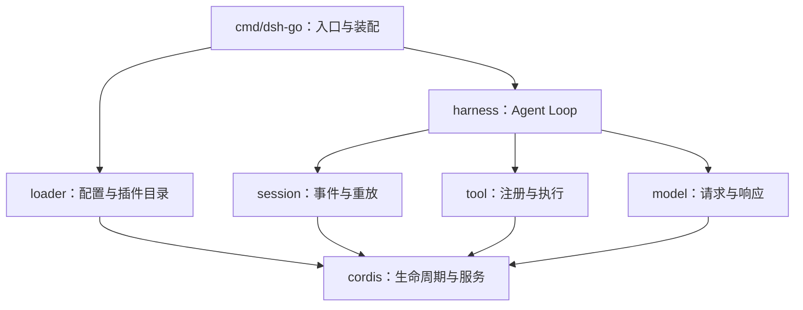

# 项目架构

## 当前目标

把 DeepSeek Harness 的可组合插件架构逐步实现为 Go 程序。第一阶段交付通用 Cordis 核心和可运行示例；后续在这个容器上组装 Session、Tool、Model 和 Agent Loop。[路线图](roadmap.md) 定义每阶段的交付条件。

## 模块与依赖方向

图中只有 `cordis` 已实现。Cordis 不导入上层模块；上层通过显式插件装配，Provider 提供实现，Consumer 依赖小接口。跨模块扩展点与其资源所有权在对应模块文档中定义。

## Go 仓库布局

选择一个 Go module：`github.com/gosomea/deepseek-harness-go`，对应独立的 GitHub 仓库。公共核心包直接放根目录，包内私有实现用小写类型和函数隐藏。只有出现多个包共享的私有实现时再创建 `internal/`。

未来源码按领域增加 `loader/`、`session/`、`tool/`、`model/`、`harness/`、`cmd/dsh-go/`。Go 自带 `vendor/` 依赖机制，因此自写的 Cordis 放在 `cordis/`。应用业务没有 handler/service/repo 层次需求时，按领域职责分包。

## Cordis 内部

| 文件 | 职责 | 行为文档 |
| --- | --- | --- |
| `context.go` | 根容器、视图、注册入口、等待与诊断 | [生命周期](cordis/lifecycle.md) |
| `plugin.go` | 插件声明、配置校验、错误 | [生命周期](cordis/lifecycle.md) |
| `fiber.go` | 实例状态、更新、重启与永久卸载 | [生命周期](cordis/lifecycle.md) |
| `lifecycle.go` | 串行协调、依赖变化、消费者优先清理 | [生命周期](cordis/lifecycle.md) |
| `effect.go` | 单次清理、倒序释放、错误汇总 | [生命周期](cordis/lifecycle.md) |
| `service.go` | 服务绑定、类型解析、作用域身份 | [服务](cordis/services.md) |
| `events.go` | 监听器与分发策略 | [事件](cordis/events.md) |
| `doc.go` | Go 包入口说明 | [包 README](../cordis/README.md) |

运行时只有一个生命周期驱动器。共享注册表受互斥锁保护；应用回调在锁外串行执行，可登记后续变更。服务对象本身不通过反射包装或复制，消费者直接使用 Go 接口。具体安全条件由 [并发与等待](cordis/lifecycle.md#并发与等待) 定义。

## 文档与门禁

每个模块有包 README、公开 Go 注释、教程或完整示例、行为参考与行为测试。文档的自动检查入口为 `make docs`，阶段交付入口为 `make check`；[测试文档](testing.md) 是这些规则的唯一维护页。学习阶段使用中文文档、英文 Go 注释；当前没有双语镜像或文档网站。
