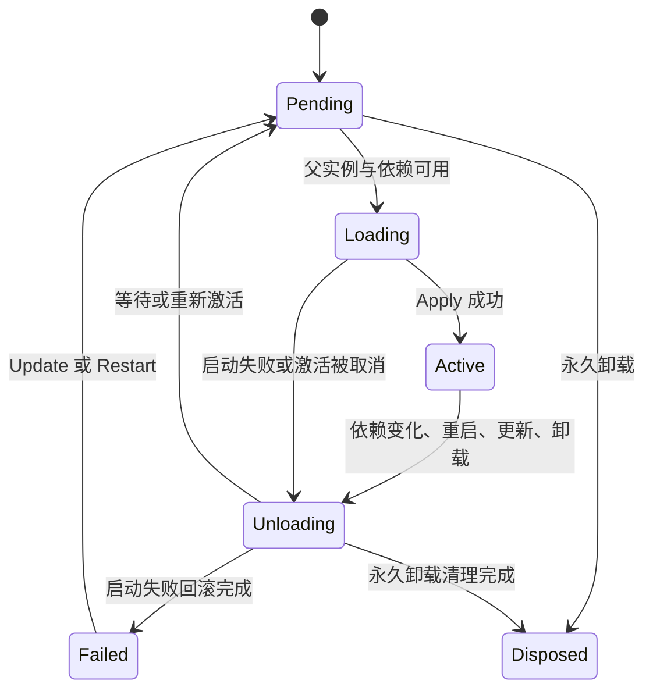

# 插件生命周期与资源清理

## 三个对象

Context 是容器与作用域视图。Fiber 是一次插件注册产生的实例，ID 在重启前后不变。激活是 Fiber 每次执行 Apply 的过程，每次得到新的 Context、取消信号、依赖绑定快照与资源列表。

旧激活的 Context 不可用于新激活注册资源。卸载完成后，Get 返回 ErrInactive；激活期间获得的服务对象仍是普通 Go 值，应用要停止自行保存的旧引用。[服务文档](services.md) 解释绑定可见性。

## 状态

实现会在 Load 结算时短暂以 Active 表示待协调的激活；带错误、已取消或配置版本过时的服务不会作为新的依赖发布，下一轮立即进入 Unloading。Pending 是已经结算的等待状态。Root 初始为 Active，关闭后永久 Disposed；根实例不可 Restart，应创建新的 Root。

## 启动与更新

`Plugin.Validate` 在注册和 Update 前执行，输入与输出为插件约定的配置类型；失败时返回错误，不创建 Fiber 或改变当前配置。`Inject` 为必需服务列表。只有父激活与全部依赖可用才运行 Apply。

Apply 可先登记服务、监听器和 OnDispose，再返回一个 Cleanup。即使 Apply 返回错误或在启动中请求自卸载，已经登记的资源和返回的 Cleanup 仍参与回滚。panic 被转换为错误，Fiber 进入 Failed；不会自动无限重试。

有效 Update 会保存已校验配置并请求重新激活；无效 Update 保持正在运行的实例。Restart 保持配置并清除启动错误，重新检查依赖。依赖消失→恢复可以使 Pending 再激活；Failed 需要显式 Update 或 Restart 重试。

## 清理顺序与所有者

运行时先将所有受影响激活标记为 Unloading，取消其 GoContext，再释放资源。子插件和注入消费者先于其父插件或 Provider 清理。同一激活内部按登记的逆序释放；Apply 返回的 Cleanup 最后登记，因此先执行。

每项清理只执行一次。公开 Disposer 的重复调用返回当前已记录的结果；如果清理仍在执行，重复调用不等待。生命周期所有者会等待已经由其他调用者启动的清理完成。不要在清理函数中等待自己，或从清理内部调用 Wait/Close。

清理出现 error 或 panic 后继续释放余下资源，并汇总到根 Wait/Close。清理错误在这个 Root 生命周期内保留；修复后创建新 Root 得到新的错误记录。永久 Dispose 移除 Fiber 注册表记录，但持有的 Fiber 仍可查看最终状态与错误。

## 并发与等待

运行时注册表受互斥锁保护，生命周期协调由一个驱动器串行执行。Apply/Cleanup 在锁外调用，允许登记资源、创建子插件或请求变更。回调内和并发发生的变更可能仅被排队；返回值只反映调用当时可见的错误。外部宿主调用 `root.Wait(ctx)` 后，再查看 Fiber 状态与 Err。

Wait 等待当前生命周期工作与已开始的资源清理，Pending 不阻塞。不要从 Apply/Cleanup 内等待，它们正是被等待的工作。`Fiber.Wait` 还会包含这个实例保留的错误，并报告根容器中的其他失败。

Close 永久标记根树、立即取消已有激活、启动清理并等待；传入的 context 到期可终止等待，但不会杀死不合作的 goroutine。宿主要通过 GoContext 取消通知自己的后台工作，并在 Cleanup 中等待工作退出。Dispose 本身没有等待超时参数；调用期间若驱动器空闲，会同步执行生命周期工作。

事件回调可并发发生。事件分发不加入生命周期清理的等待队列：已经进入的监听器可能与卸载重叠。监听器若使用会被关闭的资源，应监听取消并由插件建立自己的 in-flight 计数/等待机制。服务对象、配置对象和事件载荷的并发状态由应用负责。

## 诊断与验证

`root.Fibers()` 返回稳定诊断快照，`Fiber.State()` 与 `Err()` 为同步读取。`ctx.Logger()` 附带插件名称。生命周期验证入口为 `go test -race ./cordis`，行为与测试的对应见 [测试文档](../testing.md#行为与证据)。
